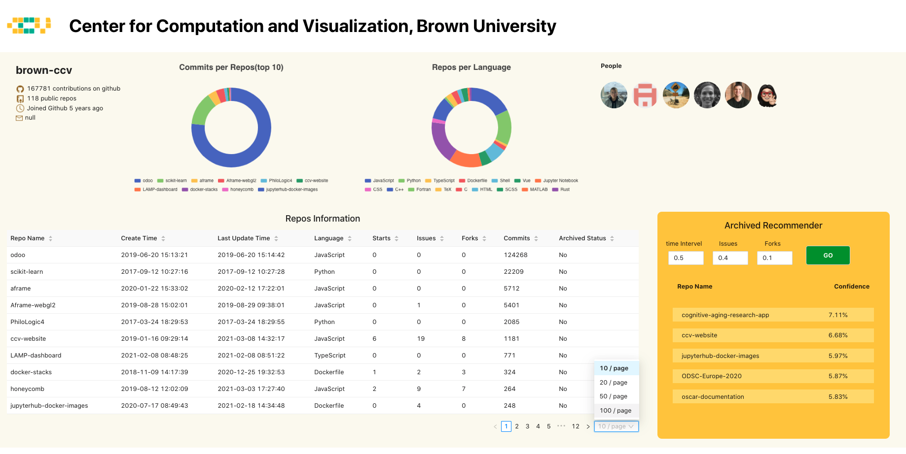

# Repositories Visualization and Archived Recommendation of Brown-ccv

## About

The main objective is to develop a Front End Web Application that provides a summary or visualization that helps CCV determine which of its public repositories in the [brown-ccv GitHub organization](https://github.com/brown-ccv) could/should be archived. 



## Built With 

In this project, I used the following framework, library and tools to built this project.

* [React](https://reactjs.org/) 
* [axios](https://yarnpkg.com/package/axios) 
* [Ant Design](https://ant.design/) 
* [Echarts](https://echarts.apache.org/en/index.html)
* [VSCode](https://code.visualstudio.com/)

## Features

1. Archived Recommender

   1. User can customize the weights of metrics (time interval, issues, forks).

      ```mathematica
      Input: timeWeight, issuesWeight, forksWeight
      
      Formula: timeWeight * ((now time - updated_time) / (4 * 31 * 24 * 60 * 60 * 1000)) + issuesWeight * issues + forksWeight * forks
      
      Output: value of each repo
      ```

   2. The system will generate the archived recommendation result represented by probability.

   3. The softmax function is used to calculate the relative probability of each repo. 

      

      

2. The two statistics figures represent **commits per repo(top 10)** and **Repos per language**.

3. Repos information table to represent the detailed informations of each repo.

## Getting Started

### Prerequisites

* yarn (on mac)

  ```sh
  brew install yarn
  ```

* VSCode

### Installation

1. Clone the repo

   ```sh
   git clone https://github.com/brown-ccv-jobs/brown-rse-spring-2021-xidaniel.git
   ```

2. Install yarn packages

   ```sh
   yarn
   ```

3. Install antd design

   ```shell
   yarn add antd
   ```

4. Install axios

   ```shell
   yarn add axios
   ```

5. Install Echarts

   ```shell
   yarn add echarts --save
   ```

6. Run Project

   ```shell
   yarn start
   ```

## Deploy to GitHub

1. Build

   ```shell
   yarn run build
   ```

2. Modify .gitignore

   ```markdown
   delete '/build' in .gitignore file
   ```
   
3. Go Settings --> Open GitHub Pages

4. Add **build/index.html** to the tail of generated link

## Contact

Xi Wang -  xiwang3317@gmail.com

Project Link: 
